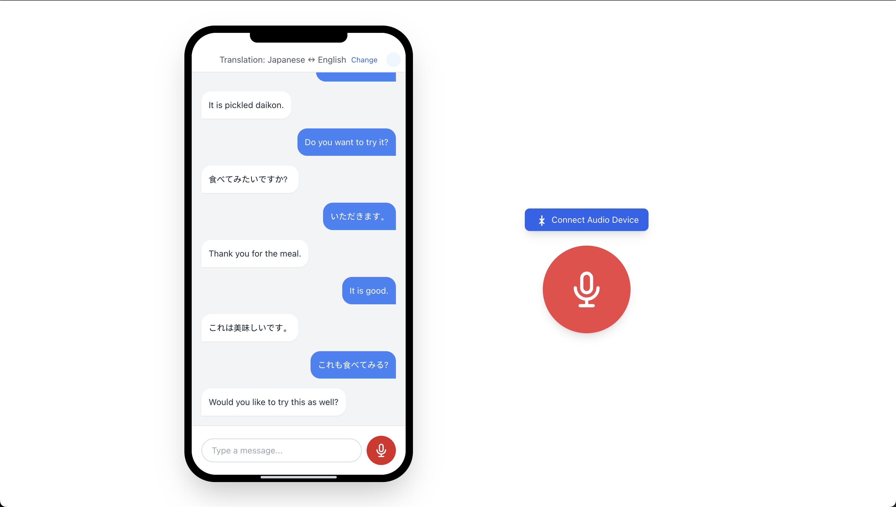

# Real-Time AI Voice Translator

A powerful application that translates spoken language in real-time using OpenAI's advanced AI models. Convert speech from one language to another instantly with high accuracy.

### Translator Demo

- [Try Live Demo](https://realtime-translator-selection.vercel.app/)
- [Watch Demo Video](https://vimeo.com/1078430059)

## Features

- Real-time voice translation across multiple languages
- High-quality speech recognition
- Natural-sounding voice output
- Simple and intuitive user interface
- Support for continuous conversations
- Zero-latency translation experience

## Usage

1. Select your source and target languages
2. Click the microphone button and speak
3. The application will automatically detect your speech and translate it
4. The translation will be spoken out loud in the target language

## Technologies Used

- Next.js 15
- React 19
- OpenAI API
- TailwindCSS
- TypeScript